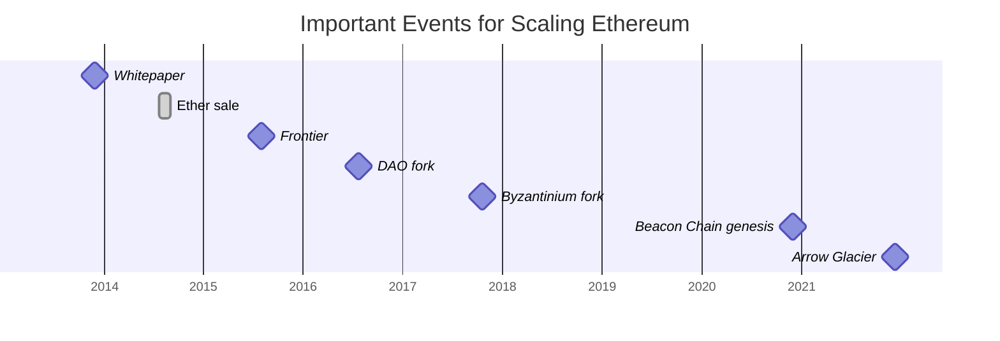

# 🏃🏻 Scaling Ethereum

"Ethereum is a technology that lets you send cryptocurrency to anyone for a small fee. It also powers applications that everyone can use and no one can take down."

### It's the world's programmable blockchain.

<!--
- a technology with this much impact and use cases should be fast and cheap
-->

---
layout: contained-image-right
image: ./img/eth_colorful.png
---

# 🏃🏻 Primer

- public
- permissionless
- decentralized
- consensus mechanism: **Proof-Of-Work**
- enables **Smart Contracts** using
	* [Solidity](https://docs.soliditylang.org/en/v0.8.14/)
    * [Vyper](https://vyper.readthedocs.io/en/stable/)
- no private transactions
- used for
	* ETH (native asset)
    * [DeFi](https://ethereum.org/en/defi/) & Dapps
    * [NFT](https://ethereum.org/en/nft/)
    * [Decentralized autonomous organizations](https://ethereum.org/en/dao/)

---
layout: contained-image-right
image: ./img/eth_colorful.png
---

## 🏃🏻 Ethereum and Bitcoin

- inspired by Bitcoins *"underlying blockchain technology as a tool of distributed consensus"*
- the Ethereum virtual machine (EVM) is turing-complete
- inherently designed to force implementation of scaling solutions by the [**"difficulty bomb"**](https://ethereum.org/en/glossary/#difficulty-bomb)
	- transition to POS
    - reduce changes of fork

---

## 🏃🏻 History

## Summary
- turing-complete EVM enables pogrammable money
- scaling is forced by design
- after multiple pushbacks the first step of the scaling vision went live (*Beacon Chain*)

*learn more about the [Ethereum History](https://ethereum.org/en/history/)*

<!-- 
- in September 2015 one ETH was priced at 1.24$ USD
- **DAO fork**
	- insecure contract was drained for over 3.6mil ETH
	- miners refused to fork because the incident wasn't a protocol defect -> *Ethereum Classic* was created
- **Byzantinium Fork**
	- delayed difficulty bomb
	- ETH price $334 USD leaving early investors at a 270x
- **Beacon Chain genesis**
	- block 1 produced
	- will coordinate the network, serving as the consensus layer
	-  introduced proof-of-stake to the Ethereum ecosystem as phase 0
- **Arrow Glacier**
	- further pushback of the difficulty bomb
	- ETH priced at $4111 USD leaving early investors at a 3315x
 -->

<!--
- L2
- but keep in mind that it enforcement still happens on the blockchain itself
  * deferral of state
  * opening and closing of payment channels
-->

---

## 🔭 The Ethereum Vision

    

- main goals: **Scalability**, Security & Sustainibility
- [Beacon Chain](https://ethereum.org/en/upgrades/beacon-chain/) coordinates shards & stakers
- [The Merge](https://ethereum.org/en/upgrades/merge/) will connect the Ethereum mainnet with the Beacon Chain POS system
- [Shard Chains](https://ethereum.org/en/upgrades/shard-chains/) will complete current scaling efforts
  * multi-phase upgrade
  * enable layer-2 solutions to offer low fees with the security of Ethereum

<!-- 
- **merge** will end POW on Ethereum
-->

---
src: ./sharding_eth.md
---

---
src: ./rollups_eth.md
---

---

# Ethereum Scaling tl;dr