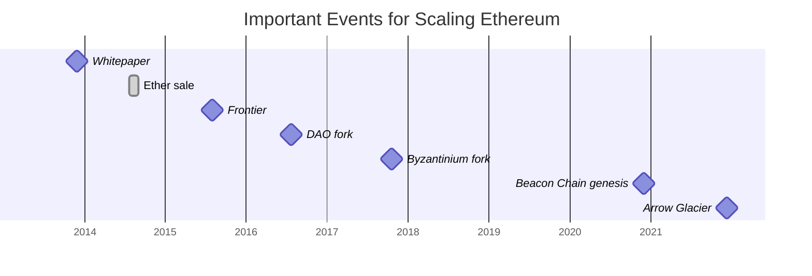

# Scaling DLT's

A short introduction for the *Blockchain Technology* Seminar SS22

---

# Outline

- **Motivation**
- **Approaches**
- **Layer-1 vs. Layer-2**
- **Lightning Network**
  - Bitcoin Scaling Problem
  - Hashed Timelock Contract (HLTC)
  - Importance for Bitcoin
- **Scaling Ethereum**
  - Primer - short introduction/recap
  - Sharding - ETH's L1 approach to scaling
  - Rollups - sharding isn't enough
- **Avalanche** - a different scaling approach based on consensus
- **Enter the rabbit hole** 🕳 🐇

---

# Motivation

 

---

# Approaches

<v-click>

Any ideas?

</v-click>

<v-click>
  
- increasing block size
- nesting blockchains
- increase consensus efficiency
- state channels
- sidechains
- bundeling / rollups
- parallelization / sharding
  
</v-click>

<!-- 
# nesting vs. sidechains
# state channels
  - no open participation
  - lock up in multi-sig contract
   application specific
# sidenchains
  - rollups utilize sidechains
 -->

---
layout: two-cols
---
<v-click>

# Layer-1

</v-click>

- increasing block size
- increase consensus efficiency
- parallelization / sharding

::right::

<v-after>

# Layer-2

</v-after>

- nesting blockchains
- state channels
- sidechains
- bundeling / rollups

---
layout: two-cols
---

# Layer-1

- main DLT network protocol itself
- scaling solutions are changes to code or network structure itself
- e.g. Bitcoin, Ethereum, Avalanche,...

::right::
# Layer-2

- protocols sitting on top of the L1 to increase scalability or add functionality
- it comes down to **offloading effort off the chain**
- e.g. Optimism, Boba, Loopring..

<!-- 
# L2
  - lower fees
  - maintain security; benefit from mainnet security
  - expand use cases
 -->

---
layout: section
---

# ⚡️ Scaling Bitcoin 

---

## ⚡️ Bitcoin Scaling Problem

- huge impact on the network if every node must know about every single transaction
- Visa's 47,000 peak tps vs. &lt;7 tps <
- 1MB block limit
- increasing block size?
- principal-agent problem

 
 

<v-click>

### *Deal with transactions off the Bitcoin blockchain itself!*

</v-click>

<!--
- performance needs to be competitive to TradFi
- higher block size -> less people have the necessary bandwidth & hardware
- centralization; blockchain trilemma
- decentralization advantages NEED to be conserved
- large miners are encourage to act on their own interests even more...
-->

---

## ⚡️ Hashed Timelock Contract (HTLC)

---

## ⚡️ Implications for Bitcoin
The Lightning Network enables the following functionality for Bitcoin

- Instant Transactions
- Exchange Arbitrage
- Micropayments
- Financial Smart Contracts
- Cross-Chain Payments

 
 

<v-click>

### *Scaling does not "just" improve the speed of a network!*

</v-click>

<!-- 
# Exchange Arbitrage
- current incentive to hold funds on exchanges
- massive cold storages for exchanges might not longer be necessary (I disagree)
  * Lightning isn't for large payments
  * institutions & whales  *exist*
              
# Micropayments
- no 3rd party custodian needed anymore
- e.g. paying per-megabyte for mobile internet

# Smart Contracts
- especially time sensitive
- complex transaction flows would be possible

# Cross-Chain Payments
- if hash function is similar across chains transactions could be routed across chains
 -->

---

## ⚡️ tl;dr
 

- opening and closing of payment channel is written on blockchain
- timelocks (HTLC's) are used to ensure communication in the channels
- enables fast and cheap Bitcoin payments down to the satoshi

---
layout: statement
---

## Is the Lightning Network a L1 or L2 scaling solution?🤔

<v-click>

L2

</v-click>

<!-- 
- L2
- but keep in mind that it enforcement still happens on the blockchain itself
  * deferral of state
  * opening and closing of payment channels
 -->

---
layout: contained-image-right
image: ./eth_colorful.png
---
# 🏃🏻 Scaling Ethereum

"Ethereum is a technology that lets you send cryptocurrency to anyone for a small fee. It also powers applications that everyone can use and no one can take down."

### It's the world's programmable blockchain.

<!--
- a technology with this much impact and use cases should be fast and cheap
-->

---
layout: contained-image-right
image: ./eth_colorful.png
---

## 🏃🏻 Primer

- public
- permissionless
- decentralized
- consensus mechanism: **Proof-Of-Work**
- enables **Smart Contracts** using
	* [Solidity](https://docs.soliditylang.org/en/v0.8.14/)
    * [Vyper](https://vyper.readthedocs.io/en/stable/)
- no private transactions
- used for
	* ETH (native asset)
    * [DeFi](https://ethereum.org/en/defi/) & Dapps
    * [NFT](https://ethereum.org/en/nft/)
    * [Decentralized autonomous organizations](https://ethereum.org/en/dao/)

---
layout: contained-image-right
image: ./eth_colorful.png
---

## 🏃🏻 Ethereum and Bitcoin

- inspired by Bitcoins *"underlying blockchain technology as a tool of distributed consensus"*
- the Ethereum virtual machine (EVM) is turing-complete
- inherently designed to force implementation of scaling solutions by the [**"difficulty bomb"**](https://ethereum.org/en/glossary/#difficulty-bomb)
	- transition to POS
    - reduce changes of fork

---

## 🏃🏻 History

## Summary
- turing-complete EVM enables pogrammable money
- scaling is forced by design
- after multiple pushbacks the first step of the scaling vision went live (*Beacon Chain*)

*learn more about the [Ethereum History](https://ethereum.org/en/history/)*

<!-- 
- in September 2015 one ETH was priced at 1.24$ USD
- **DAO fork**
	- insecure contract was drained for over 3.6mil ETH
	- miners refused to fork because the incident wasn't a protocol defect -> *Ethereum Classic* was created
- **Byzantinium Fork**
	- delayed difficulty bomb
	- ETH price $334 USD leaving early investors at a 270x
- **Beacon Chain genesis**
	- block 1 produced
	- will coordinate the network, serving as the consensus layer
	-  introduced proof-of-stake to the Ethereum ecosystem as phase 0
- **Arrow Glacier**
	- further pushback of the difficulty bomb
	- ETH priced at $4111 USD leaving early investors at a 3315x
 -->

<!--
- L2
- but keep in mind that it enforcement still happens on the blockchain itself
  * deferral of state
  * opening and closing of payment channels
-->

---

## 🔭 The Ethereum Vision

    

- main goals: **Scalability**, Security & Sustainibility
- [Beacon Chain](https://ethereum.org/en/upgrades/beacon-chain/) coordinates shards & stakers
- [The Merge](https://ethereum.org/en/upgrades/merge/) will connect the Ethereum mainnet with the Beacon Chain POS system
- [Shard Chains](https://ethereum.org/en/upgrades/shard-chains/) will complete current scaling efforts
  * multi-phase upgrade
  * enable layer-2 solutions to offer low fees with the security of Ethereum

<!-- 
- **merge** will end POW on Ethereum
-->

---
layout: contained-image-right
image: ./sharding_eth.png
---

## 🏃🏻 Sharding

---
layout: contained-image-right
image: ./sharding_eth.png
---

## 🏃🏻 Rollups

---

# ❄️ Avalanche - Finding Consensus

---
layout: statement
---
# Questions?

---

# Enter the rabbit hole 🕳 🐇
- [DeFi Developer Roadmap](https://github.com/OffcierCia/DeFi-Developer-Road-Map)
- [Ethereum Upgrades](https://ethereum.org/en/upgrades/)

---

# Sources
- [Ethereum Illustrations](https://ethereum.org/en/assets/#illustrations)
- [Avalanche Illustrations](https://support.avax.network/en/articles/4132288-ava-labs-and-avalanche-press-kit-and-brand-assets)

---
layout: center
class: text-center
---

## Thank you for your attention!

<!--
[Documentations](https://sli.dev) · [GitHub](https://github.com/slidevjs/slidev) · [Showcases](https://sli.dev/showcases.html)
-->
